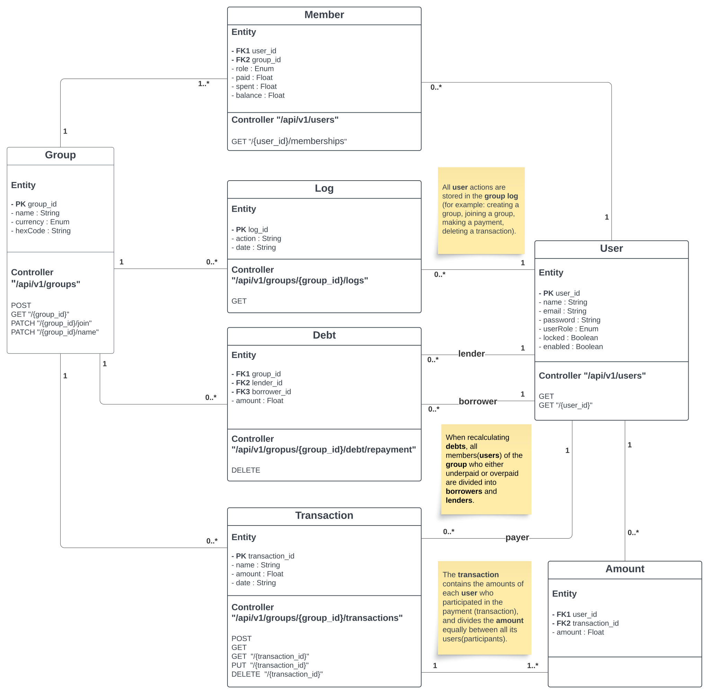

# Chipin, Mobile application for debt management in group trips

## Description
Chipin is a mobile app for debt management in joint trips. In the application, it will be possible to create a group to which friends 
will join before the trip. Then users can add transactions of who paid for whom in a restaurant, for museum tickets, for hotel 
accommodation, and so on. The application calculates all debts (including currency conversion if the trip is to a country with a 
different currency), and clearly shows who must pay the debt after returning home.

## [Domain Model UML]



## [Administrator's Manual]

### Configuration

#### Application configuration in Java Spring Boot with PostgreSQL

This section describes the configuration of our Java Spring Boot application. We are using PostgreSQL as the database and have configured various aspects of the application.

#### Location of configuration files

`chipin/src/main/resources`: In this directory we store general application settings, such as database connection settings and other general settings.

#### application.properties:

#### Database connection parameters

To configure a connection to a PostgreSQL database, we use the following parameters:

- `spring.datasource.driver-class-name`: Database driver class (PostgreSQL).
- `spring.datasource.username`: Database user name.
- `spring.datasource.password`: User password.
- `spring.datasource.url`: URL to connect to the database. (Create a chipin database and a chipin schema).
  example:
   - Configuration for local usage    :
     `spring.datasource.url=jdbc:postgresql://localhost:5432/chipin`
   - Configuration for use with Docker:
     `spring.datasource.url=jdbc:postgresql://db:5432/chipin`


#### Hibernate settings

To work with Hibernate, we have set the following parameters:

- `spring.jpa.hibernate.ddl-auto`: Database schema update mode.
- `spring.jpa.properties.hibernate.dialect`: (Using PostgreSQL).
- `spring.jpa.properties.hibernate.default_schema`: Defines the default database schema that will be used for all queries performed by the application.

#### Security Settings

To ensure the security of the application, we have the following parameters:

- `spring.security.oauth2.resourceserver.jwt.issuer-uri`: URI where JWT tokens are validated.
- `spring.security.oauth2.resourceserver.jwt.jwk-set-uri`: URI to get a set of JWK (JSON Web Key) for validating JWT tokens.

#### Port and SSL settings

We set the port on which our application runs:

- `server.port`: The port on which the application is running. (We use 8080)

We also provide SSL settings for secure data exchange:

- `server.ssl.key-store`: Path to the key store.
- `server.ssl.key-store-type`: Key store type.
- `server.ssl.key-store-password`: Password for accessing the key store.
- `server.ssl.key-password`: Password for keys in the storage.
- `server.ssl.key-alias`: Key alias.


### Dependencies

All dependencies are written in `build.gradle`, in addition, configure the database.

#### Descriptions of dependencies in build.gradle

`plugins`: This block lists the Gradle plugins that have been added to our project: 
- **java**: The java plugin allows us to develop applications in the Java language and provides basic compilation and assembly functions. 
- **org.springframework.boot**: This Spring Boot plugin is used to develop Spring Boot based applications. It makes it easy to configure and build a Spring Boot application. 
- **io.spring.dependency-management**: This plugin provides support for dependency management using Spring's BOM (Bill of Materials). It makes dependency versioning easier.

`group, version, sourceCompatibility`: These parameters define the group and version of our project and the minimum version of Java that our project supports. In this case it is Java 17.

`configurations`: This block defines the compileOnly configuration, which inherits from annotationProcessor. This is used to separate out libraries that should only be visible at compile time and should not be included in the final JAR file. In our project, the Lombok library is used to simplify the code, but should not be included in the final build.

`dependencies`: This section lists the dependencies of our project. This includes Spring Boot libraries such as Spring Data JPA, Spring Web, Spring Security, and others, as well as the PostgreSQL JDBC Driver, which is used to communicate with the PostgreSQL database.

#### Docker

The project has a Dockerfile and docker-compose.yml, which are the tools for containerizing and deploying the application.

### Database

The Chipin project uses the PostgreSQL database.

Initially, you need to install PostgreSQL on your device where the database will be located. You can do this using the instructions at the following link: [PostgreSQL](https://www.postgresql.org/download/)

If you want to use a local database and when you start the project the database is not created automatically and you receive an error like "ERROR: database "chipin" does not exist" or error like "ERROR: schema "chipin" does not exist", then you need to create the database manually.

**Linux:**
1. Option:
You can run the script located in /chipin/src/main/resources/db/bash_create_database.sh and it will create a database and schema.
```
chmod +x bash_create_database.sh
```
```
./bash_create_database.sh
```

2. Option: 
You can create it yourself by following these steps in your terminal.
```
sudo -i -u postgres psql
```
```
CREATE DATABASE chipin OWNER postgres;
```
```
\c chipin;
```
```
CREATE SCHEMA chipin;
```


